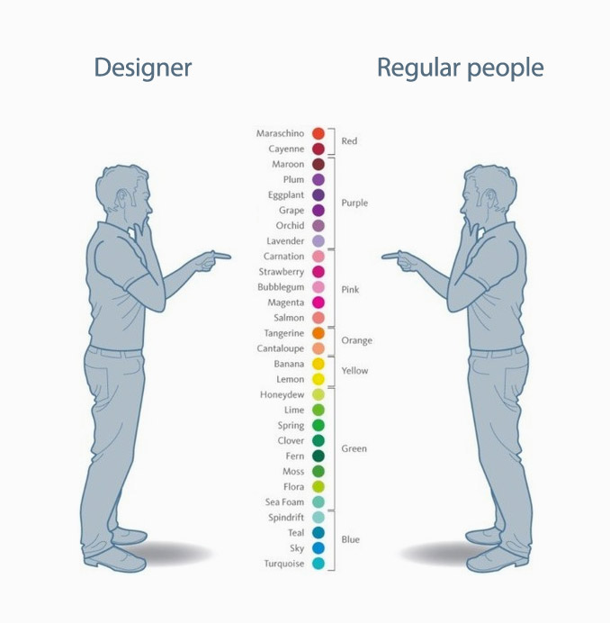
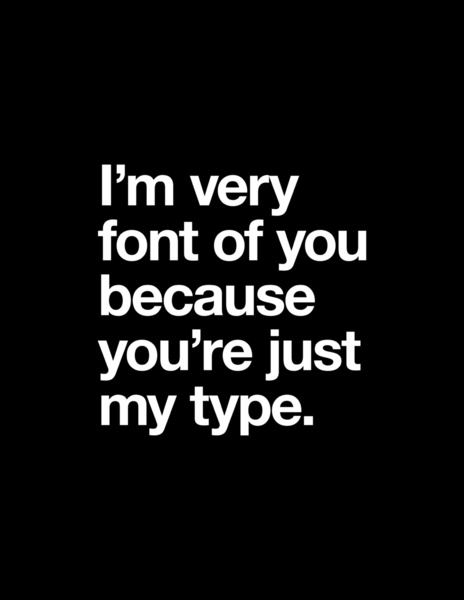
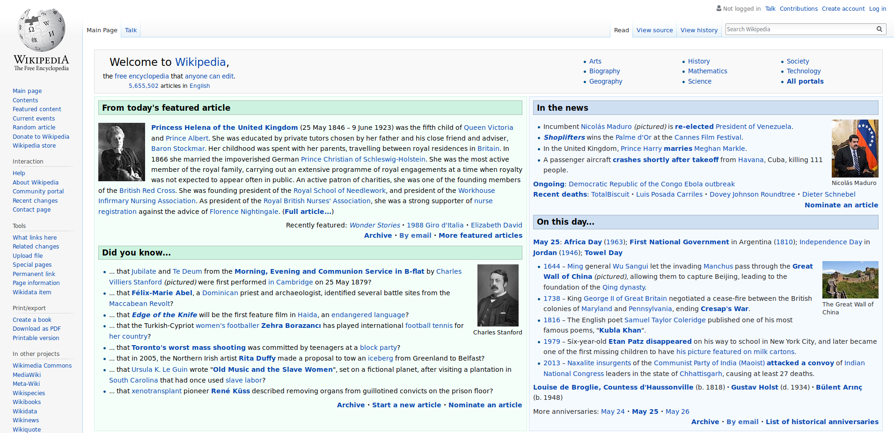
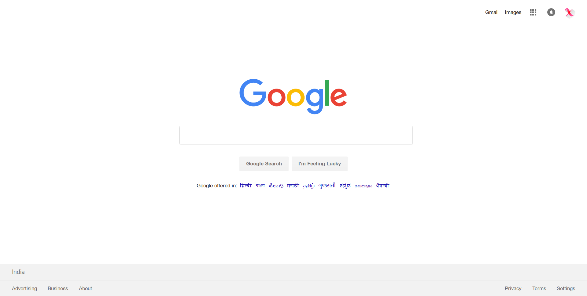
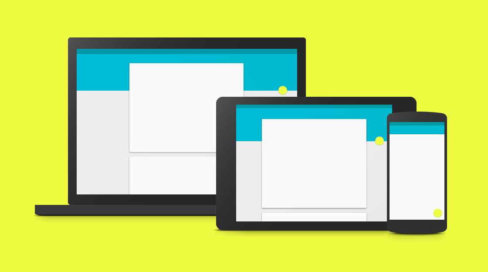

+++
title = "Design Tips"
description = "A general set of Tips regarding Design"
date = 2018-05-25

[taxonomies]
categories = ["design"]
tags = ["design", "typography"]

[extra]
metadata_image = "/posts/design-tips/design-tips-cover.jpg"

+++


Cover found on the Internet


Hi, I have been practicing the art of designing web pages for a long time (a few years at least). And I have made some (objective term) progress. Here I would present some resources that you can go through to help in designing websites. Also, I would recommend a few tips which would help you boost your design.

## Observation

The first good skill that you need to obtain to start designing is Observation. Look and Observe how others have designed their websites. Also, do not limit yourself to a standard site such as Google or Facebook for design inspiration. You can browse these sites for a taste of what good design looks like:

- [CSS Design Awards](https://cssdesignawards.com/) Look here for the best of the best, But Don't be overwhelmed and depressed. These are the best-designed websites
- [CSS Mania](http://www.cssmania.com/)
- [CSSDSGN](https://www.cssdsgn.com/)
- [HTML5up](https://html5up.net/) I would recommend only to observe the design and if needed download and learn how to design a specific thing rather than copy-pasting the whole template. You would complete the website; But would you learn?

Another amazing tool to help you in the task of observation is **Developer Tools**. These are available in all major browsers. [Chrome DevTools](https://developers.google.com/web/tools/chrome-devtools/) and [Firefox Developer Tools](https://developer.mozilla.org/en-US/docs/Tools). A cool tip to note: you can add new styles in DevTools and see them updated live on the webpage, Awesome for testing different colors padding etc to see what fits right. (Note that changing code in DevTools does not change it in your files)

## Understanding color

While I agree that color theory is a vast topic and I don't quite understand all of it, I still can recommend a few websites from where I have developed my sense of color:

- [Color Theory for Designers - Smashing Magazine ](https://www.smashingmagazine.com/2010/01/color-theory-for-designers-part-1-the-meaning-of-color/)
  I love the Smashing Magazine Blog. They cover detailed explanations and examples of design. And this blog series, in particular, is a gem. I have developed most of my color choice from these articles. Make sure you read all three!

- [A Simple Web Developer's Color Guide](https://www.smashingmagazine.com/2016/04/web-developer-guide-color/)
  Another article from Smashing Magazine. Nice and simple.

Enough about theory what about Tools?

- [ColorHexa](https://www.colorhexa.com/) - Literally they say themselves as a color encyclopedia
- [PALETTABLE](https://www.palettable.io/) - Create a color palette by liking/disliking (It ain't FB)
- [COLOURlovers](http://www.colourlovers.com/) - The site where I found great colors. Also, check out the [Top palettes](http://www.colourlovers.com/palettes/most-loved/all-time/meta) on this site, they are beautiful.
- [Adobe Color CC](https://color.adobe.com/create/color-wheel/) - Don't Worry it's free! It's also amazing, especially for extracting color from images.
- [GPick](http://www.gpick.org/) - I use this tool a lot to collect the colors I love. It's available in Ubuntu repos as `gpick`

## Using Fonts

The most dramatic effect of any one thing on design is that of the font. (Just think of designing something in Comic sans except of course Comics). I really like typefaces. And here are some sites to learn more about them:

- [Design Theory: 5 Basic Principles of Typography](https://pixel77.com/principles-of-typography/) - Sums up the basic points of using typefaces
- [Webdesign
  Choosing the Right Font: A Practical Guide to Typography on the Web](https://webdesign.tutsplus.com/articles/choosing-the-right-font-a-practical-guide-to-typography-on-the-web--webdesign-15)

Getting the right fonts is not a headache, thanks to [Google Fonts](https://fonts.google.com/). It's an amazing site from where you can download and even link your fonts through CSS/link tags so that the font is shown in your client's browser even if they haven't installed it!

There are a few other sites that provide free fonts but most of them either are free for personal use or cost some \$Dolla.

I also compiled a set of great fonts available on Google fonts when I created the [FontStaller](https://github.com/xypnox/fontstaller/) script. You can find them [here](https://github.com/xypnox/fontstaller/releases/download/v1.0.0/fonts.zip).

### Tips n Tricks

#### Minimalism is the way to go

> Minimalism is not a lack of something. It’s simply the perfect amount of something. — Nicholas Burroughs

By having a lot of things on the website at the same time confuses people and gives a sense of clutter and disorder. Put something there only if it needs to be there. Simplify Reduce Iterate. Just look at Wikipedia. It isn't quiet aesthetic as other sites and looks like a mess in the modern age. Whereas a quick look at Google explains the point of simplicity.

But don't remove everything. As once a great man said:

> Everything should be made as simple as possible, but not simpler. - Albert Einstein

#### Test different screen sizes

I know it is hard to design for your own screen size, much harder to design for several. But that is what makes or breaks a design. People would not just be browsing your website from your specific machine. They might use a phone a tablet or unfortunately a smart-TV. Make your website at least a little mobile friendly by adding a few media tags.

#### Advance stuff : Sass

Ever since I learned about [Sass](http://sass-lang.com/), I have used it everywhere. It is a CSS preprocessor. By that I mean, it is a language that compiles to generate CSS. But why would we need something else? Because it simplifies things. Here is the [official guide](http://sass-lang.com/guide) if you are feeling curious.

#### Use some extensions

I know editing CSS files is not that hard, you don't need extra debugging stuff and linters. But a few extensions do make the job easier. These are a few extensions that I use in [Atom](https://atom.io/):

- [color-picker](https://atom.io/packages/color-picker) I love this plugin
- [pigments](https://atom.io/packages/pigments) this one too
- [css-snippets](https://atom.io/packages/css-snippets)
- [ language-CSS ](https://atom.io/packages/language-css) This comes as preinstalled.

Thanks for reading, Hope I might have been of some assistance in your Aim to nail down the best design ever!
