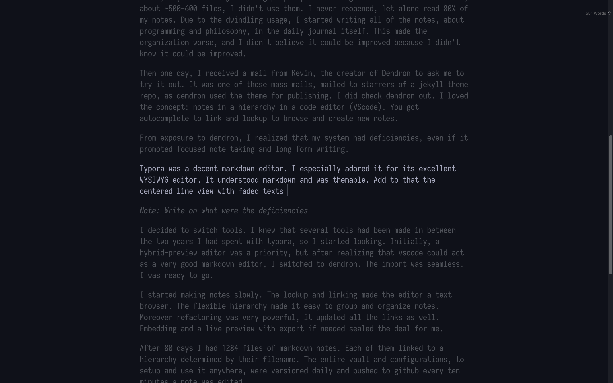

+++
title = "Notes: Intro"
description = "Once when I was foolish and clever, I thought I would never need to write anything down. That I will remember everything forever. I lived with this assumption till I came to my senses."
date = 2021-06-13

[taxonomies]
categories = ["tech"]
tags = ["tech", "blog", "notes", "dendron"]

[extra]
metadata_image = "/posts/notes/intro/cover-intro.png"

+++


An introduction to a Journey in note taking.


Once when I was foolish and clever, I thought I would never need to write anything down. That I will remember everything forever. I lived with this assumption till I came to my senses.

I [started making notes](https://www.xypnox.com/blag/posts/moving-notes-to-github/) 2 years ago. I decided on [markdown(md)](https://www.markdownguide.org/) files in a git repository to be sufficient tooling required. I organized the files in folders and relied on git for version control a.k.a history. The few tweaks, a typora theme, scripts to automate git commands, etc, were enough at that time. I used Typora to edit the notes.

Along with note taking, I also started journaling, rarely. Then at the start of this year,2021, I started journaling properly. Even though I made a lot of notes, I didn't use them. I never opened them, let alone read them. Due to the dwindling usage, I started writing all of my notes, about programming and philosophy, in the daily journal itself. This made the organization worse. I didn't believe it could be improved because I didn't know it could be improved.

Then one day, I received a mail from Kevin, the creator of [Dendron](https://www.dendron.so/) to asking me to try it out. It was one of those mass requests, mailed to starrers of a [jekyll theme repo](https://pmarsceill.github.io/just-the-docs/), as Dendron used the theme for publishing. _I did check Dendron out_. I loved the concept: notes in a hierarchy, in a code editor ([VScode](https://code.visualstudio.com/)). You got autocomplete to link and lookup to browse and create new notes.

From exposure to dendron, I realized that my system had deficiencies, even if it promoted focused note taking and long form writing.

Typora was a decent note taking tool. I adored it's excellent WYSIWYG md editor. It was theme-able. The cherry on top was the editing view: centered cursor with only the current paragraph highlighted, it made writing for long durations a pleasure. However, Typora couldn't manage files. You could only open multiple files as tabs on Mac, and the directory structure was clunky. Linking was a distant dream and refactoring a nightmare. A mess of 600 files. _..screaming.._

I decided to switch tools. I knew that several had been made in the two years I had spent with Typora, so the hunt began. Initially, a hybrid-preview editor was my priority. However, after realizing that vscode could act as a very good md editor, I switched to Dendron. The import was seamless. I was ready to go.

I started making notes slowly. The lookup and linking made the editor a text browser. The flexible hierarchy made it easy to group and organize notes. Moreover refactoring was very powerful, it updated all the links as well. Embedding and a live preview with export if needed sealed the deal for me.

After 80 days I had 1294 md notes. Each of them linked to a hierarchy, determined by their filename. The entire vault and configurations (to setup and use it anywhere) were saved in the repo and were versioned daily. Moreover every 10 minutes any changes were backed up to github. In the end, all I had to do was write notes, linking and hierarchy was handled by Dendron, history and backup was handled by git.

While I was looking for a tool to switch and while I was using Dendron, I read and thought about note taking and various _tools_: like obsidian, notion, evernote, etc, and methods: like zettlekasten, para, bullet journaling etc.

I will share my thoughts and my current system of note taking in [these few posts](../notes/) (another 3 probably). The first few will be about the tools and strategies that exist for note taking. In the last post I will describe and explain my own note taking system.

TLDR for the three posts:

> Note taking by itself is just a dump of ideas, to utilize that dump to do something productive is the most important part. The total output of the notes depends not only on the method used to store the notes but also the quality of what is being stored. You are what you eat, and in this case, you get what you put in.

The explanations will be discussed in the posts that follow.
